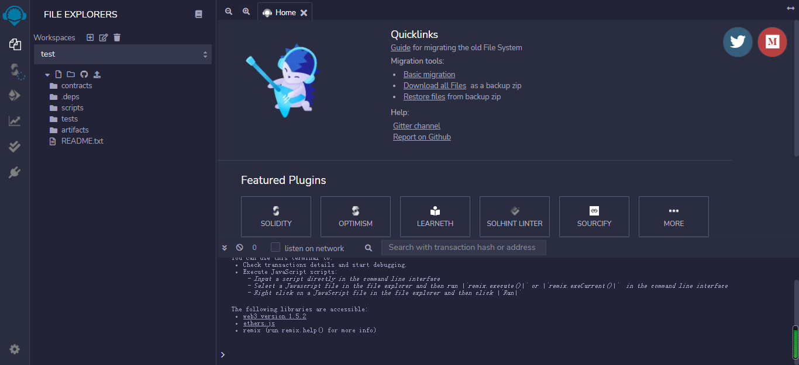
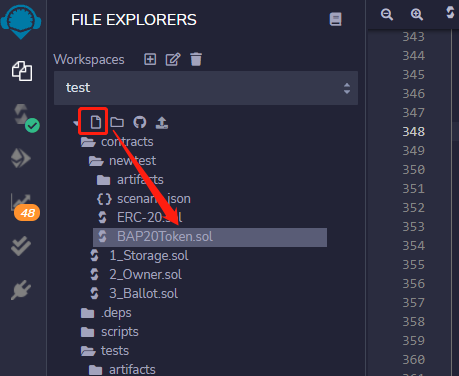
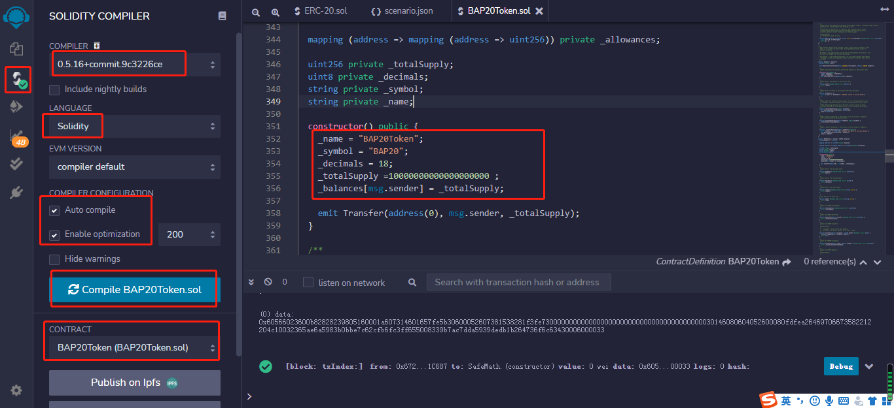
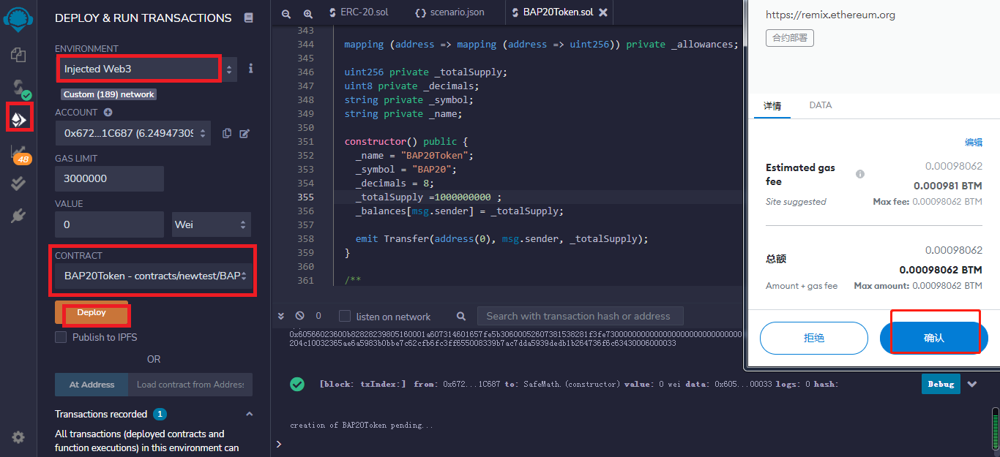
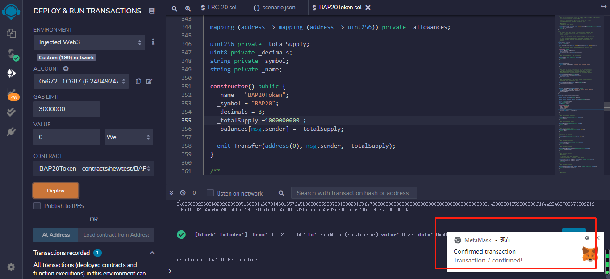
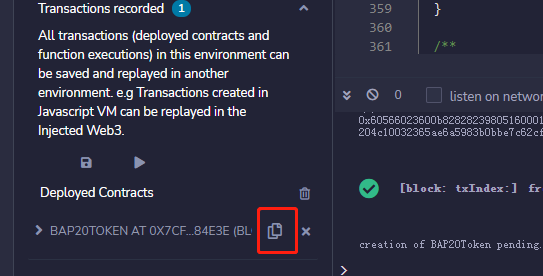
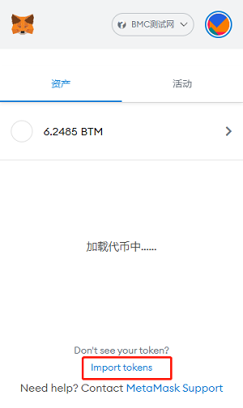
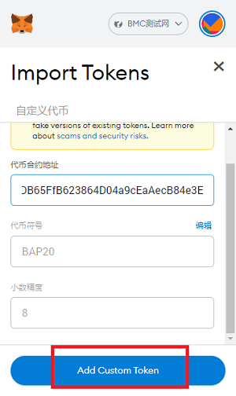
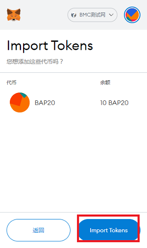
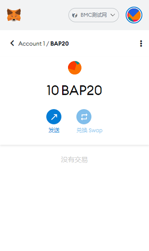

## ISSUE TOKEN

### 1.Prepare ERC20 contract

We use Remix to write, compile, and deploy smart contracts.

Remix is a browser IDE with "no setup" for developing EVM smart contracts.

Click [https://remix.ethereum.org/](https://remix.ethereum.org/) to open Remix.

Select the Solidity language to create a new BAP20 contract. Here, the contract is named `BAP20Token.sol`, or you can specify it yourself.

You can write the code content yourself or click [here](https://github.com/Bytom/bmc-genesis-contract/blob/main/contracts/bap20_template/BAP20Token.template) to copy the code.

After that, you can change the "name", "symbol", "decimals" and "totalSupply" of the asset you want to publish. Please modify it to the format shown in the picture below.

### 2. Compile smart contract

On the left sidebar, select `Solidity Compiler`, select the matching version, select `BAP20Token`, check `Auto compile` and `Enable optimization`, and click `Compile BAP20Token.sol` to compile the contract.

### 3. Deploy smart contracts

On the left sidebar, select the option `Deploy & run transactions`. Choose `injected web3` as the environment. Change CONTRACT to `BAP20Token` and click `Deploy`.

A metamask window will pop up here, confirm whether to connect Metamask to Remix, click Next, click Connect.

A prompt of successful deployment pops up.

### 4. Import assets into wallet

Copy the contract address in the lower left corner.

Open MetaMask, slide to the bottom and click `import tokens`.

Paste the contract address into the address bar, click Add, and continue to select import.

The previously created assets are now in the wallet.

